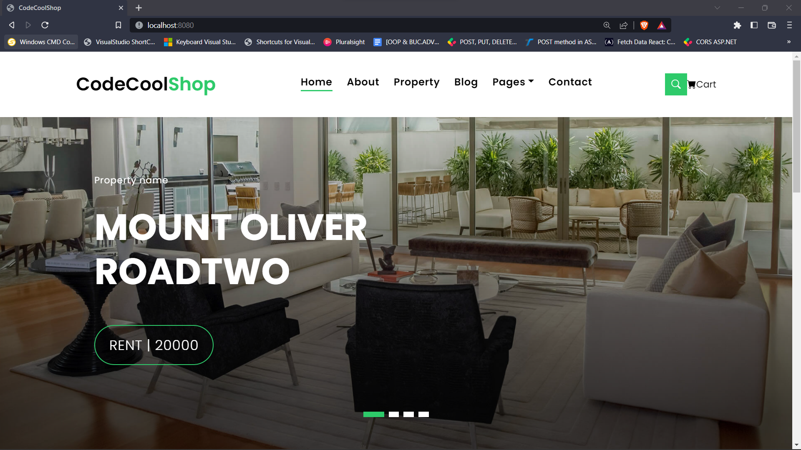
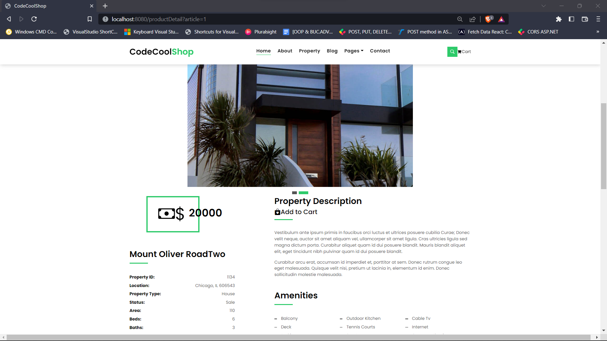
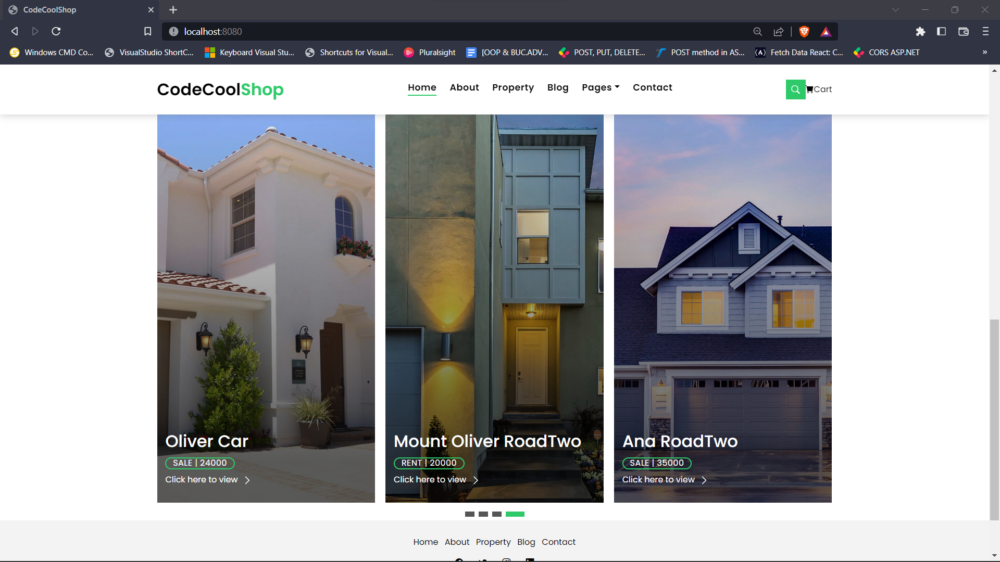

## CodeCool-Shop

### Project Description:
- CodeCool-Shop is a simple and interactive __Web Application Service__ which offers you the possibility to buy or rent a property from different parts of the world.
  For the backend this service is build with __Java__ && __Java Servlets__, the User Interface part is build with __JavScript__ && __Thymeleaf__, although for the FrontEnd I managed to implement and understand a real [Website Page Template](https://bootstrapmade.com/real-estate-agency-bootstrap-template/)

### Project includes:
- Object-Oriented Programming Practices
- Complex MVC Design Pattern
- Java Servlets
- Thymeleaf
- [Complex Project Template Integration](https://bootstrapmade.com/real-estate-agency-bootstrap-template/)

### Benefits of integrating an already built template:
1. It's help you to understand best practices
2. You manage to understand how a complex FrontEnd design is structured
3. In the case that you need to add something new you are forced to respect the already built structure and that makes you more aware of your project
4. Improves the logical thinking being forced to understand the already written code
5. It's help you to adopt the best naming conventions
6. This practice opens your mind to new approaches in matters to *'how things can be done'*

### How Run the Project and Dependencies:
#### How to Run the Project
1. In the *"Edit Configuration Section"*, near run button you should add a new __Maven Configuration__
2. In the *"Run"* field you need to type __jetty:run__
3. Then apply and save changes
4. Run The Project
#### Dependencies used:
1. [Java 18](https://www.oracle.com/java/technologies/javase/jdk18-archive-downloads.html)
2. [Thymeleaf](https://www.thymeleaf.org/download.html)
3. [Jetty Server](https://docs.huihoo.com/jetty/the-definitive-reference/jetty-maven-plugin.html)
4. [Java Servlets](https://www.baeldung.com/intro-to-servlets)
5. [A Google Package for Serialization and Deserialization](https://github.com/google/gson/blob/master/UserGuide.md)

